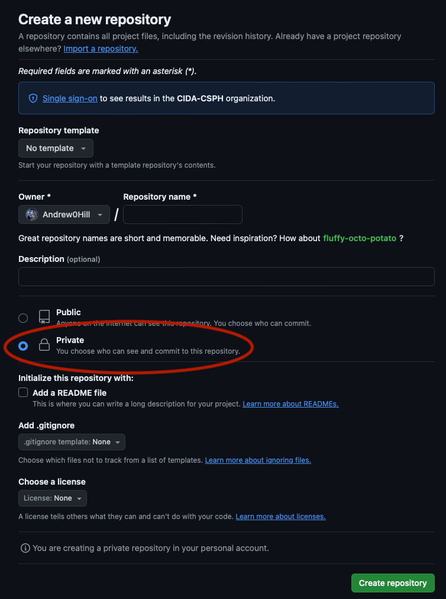
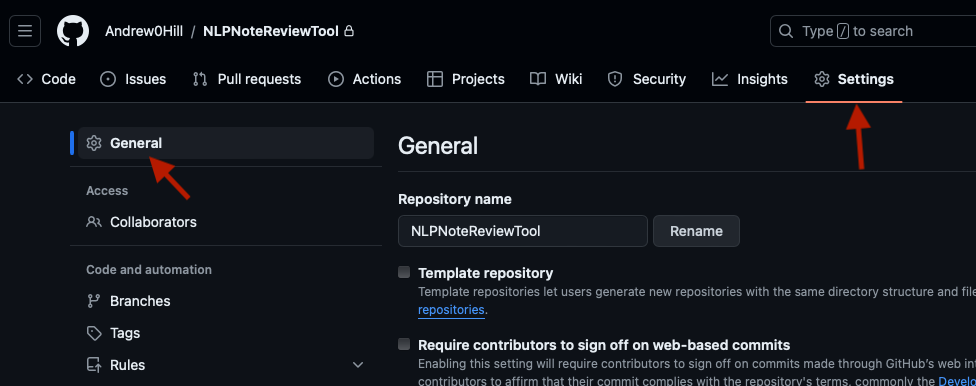
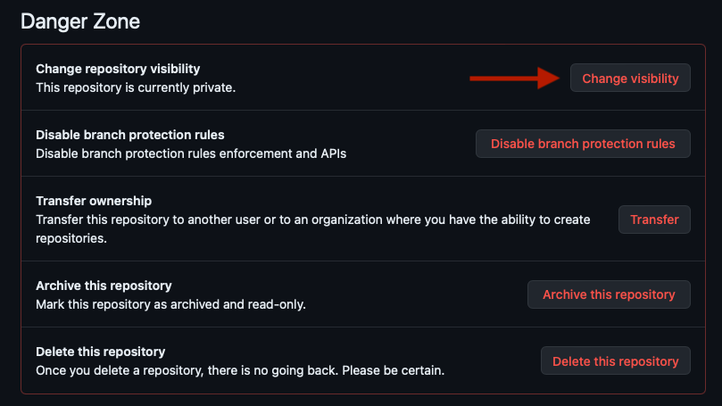
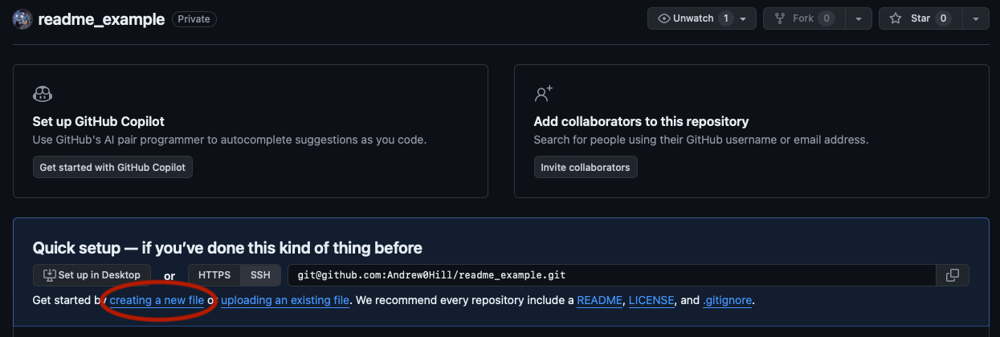
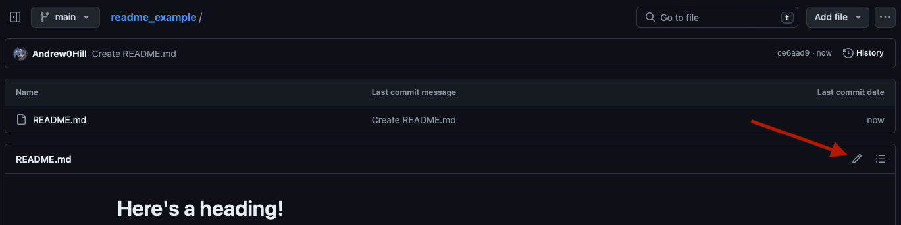
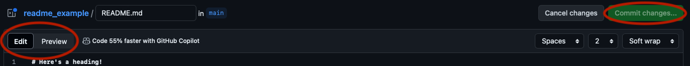
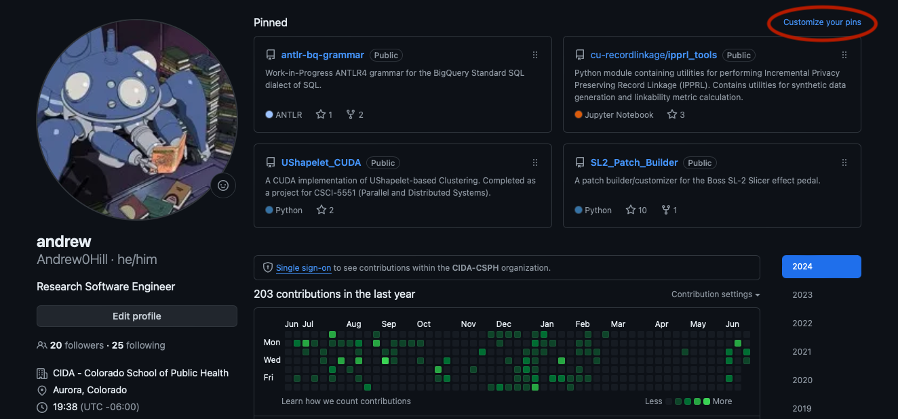
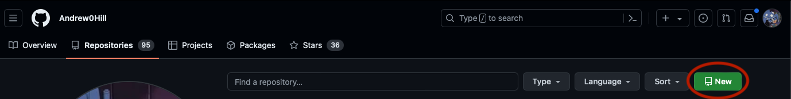
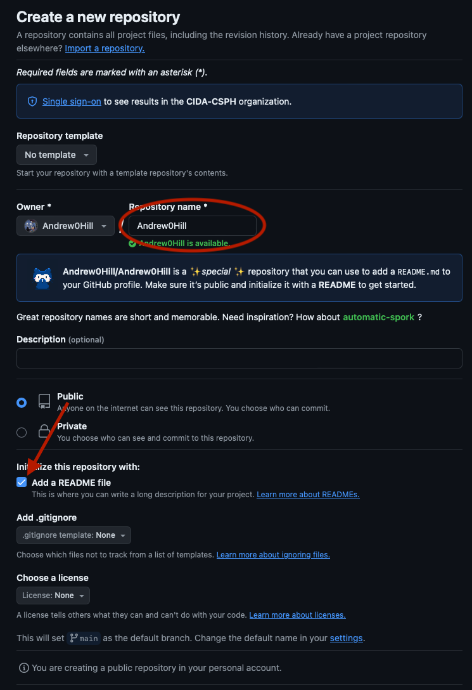
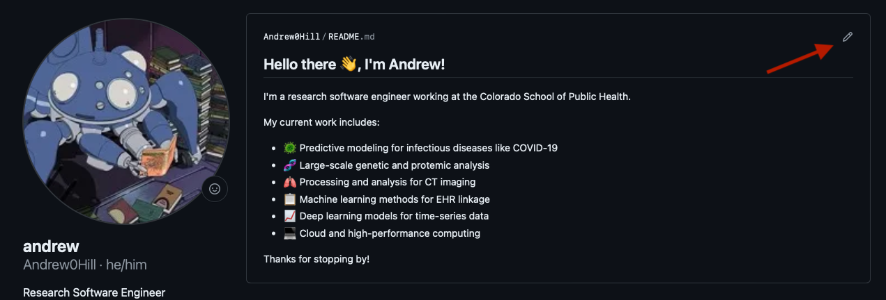

# Tips for a GitHub Profile

This is a quick guide outlining some ideas to make a presentable GitHub profile, as a complement to your CV or Resume.

## Complete Your GitHub Profile

Take some time to fill out the information on your GitHub profile, so that it looks more complete than a 'default' user profile:

1. Change your profile picture from the default icon. This can be a picture of you, but doesn't have to be.
2. You can use the "Edit profile" button to fill out any information you are comfortable sharing.  
2. You can add links to your profiles on other websites using the `Edit profile` button.

## Clean Up Your Old Repositories

If you are providing a GitHub link as part of your Resume/CV, it is a good idea to do some housecleaning on your GitHub repositories.

As of 2019, GitHub allows you to have *unlimited* private repositories (in the past, you used to have a limited number of private repos with an unpaid account).

This means you can keep any repository which you don't want someone browsing through private.

You can mark a repository as private when you create it:

or you can make an existing repository private by navigating the repository Settings -> General -> Danger Zone -> Change Visibility.

> [!TIP] 
> In my opinion, it is a good idea to create all of your repositories as Private, then convert them to Public if/when you want people to be able to view them (i.e. Your project is finished, paper published, etc).

## Add `README.md`s To Your Public Repositories

A `README.md` file is a Markdown document which can serve as an introduction to your repository/project. The `.md` file extension indicates that the file is written in the Markdown syntax (if you use RMarkdown, you may already be familiar with some of the Markdown syntax). Although you can also create a `README.txt` for a plain text file. I would recommend making a `README.md` file for any projects uploaded to GitHub, as GitHub will automatically display the Markdown formatting for a `README.md` in the root directory, which looks much nicer than plain text. 

Markdown is a relatively simple syntax to learn, but has quite a bit of useful functionality. You can create headings/sections, add bulleted or numbered lists, display blocks of code, embed images, and more. 

A complete reference to the Markdown syntax which can be displayed on GitHub is available at this link: [GitHub Markdown Syntax](https://docs.github.com/en/get-started/writing-on-github/getting-started-with-writing-and-formatting-on-github/basic-writing-and-formatting-syntax)

### Creating a `README.md`

If you have an empty repository, you can create a README by clicking the "creating a new file" button on your repository page, then naming it `README.md`.

If you've already created a README.md in your repository, you can edit it by clicking the pencil icon at the top right of the README box.

After creating or editing your README, you should be presented with GitHub's file editor, which allows you to wuickly edit and preview your README by switching between the "Edit" and "Preview" tabs on the editor. When you've completed editing, you can commit your changes by clicking the green "Commit changes..." button.

> [!TIP]
> Although GitHub's user interface is OK for quick edits, I recommend using a dedicated text editor like Visual Studio Code for writing large README files.  

### README Best Practices

In my opinion, a README for a public project should contain at least:
1. **Title/Introduction** - A short summary explaining the purpose/function of the project
2. **Installation Instructions** - A short description of the software dependencies needed in order to run the code, if a user were to clone this repository.  
    - For example, what software dependencies are needed to run your code? Does your code run in R? Python? What libraries/packages does your code use?
3. **How-To or Example Code** - Once a user has cloned your repository and installed all depdencies, how can they run your code?
    - If your code is a script, provide a code snippet that shows how the script can be run, including any arguments required. 

Here are a few public repositories which have good (in my opinion) `README.md` files:
1. [lungmask](https://github.com/JoHof/lungmask) is the repository for the `lungmask` package, a popular tool for CT Image Segmentation. This README contains a description of the available segmentation models, shows results from each model, and describes steps for installing and running the code.
2. [TensorFlow](https://github.com/broadinstitute/tensorqtl) is the repository for `tensorflow`, Google's open-source deep learning framework. The README brielfy describes TensorFlow, describes how to install it, and walks the user through running a simple program using Tensorflow.

And here are a few example `README.md` files I have made in the past:
1. [UShapeletCUDA](https://github.com/Andrew0Hill/UShapelet_CUDA) contains code for an old class project. The README contains an explanation of the project, requirements, usage, and also embeds some figures to show results.
2. [ipprl_tools](https://github.com/cu-recordlinkage/ipprl_tools) is a Python package created to assist in performing linkage/entity resolution in Electronic Health Record (EHR) data. This repository contains instructions for installing and using the package, but could use a better description :see_no_evil:.
2. [SL2_Patch_Builder](https://github.com/Andrew0Hill/SL2_Patch_Builder) contains code for a recent personal project. The README contains an explanation of the project, and uses inline code blocks to show instructions for installing and running the code.

## Choose Repositories To 'Pin' On Your Profile

Your GitHub profile allows you to 'pin' up to 6 public repositories at the top of your profile page. Pinning a repository will display its name, description, as well as other statisitics like programming language used.

You can customize your pinned repositories by clicking the 'Customize your pins` button on the top right of your profile page.

I think the pinned repository section is a great way to showcase work you have done in the past, and an especially good way to show off repositories which relate to work in your Resume/CV.

Some potential ideas for pinned repositories:
1. Repositories containing work that you mention on your Resume or CV (if you are allowed to publicly release code)
2. Repositories containing code from published papers/abstracts/etc (if you are allowed to publicly release code)
3. Repositories with large academic projects (i.e. class final projects, thesis code, etc).
4. Repositories containing any personal projects (projects you did for independent learning, fun, etc)

You can 'pin' any repository which you are a contributor to, even if it belongs to another user or organization.

> [!TIP] 
> I would recommend making sure that each repository you 'pin' has at least a description (since the description is displayed as part of the pinned repository) but ideally also a descriptive `README.md` that describes the project and how to use it. (See [Add README.md to Your Public Repositories](#add-readmemd-to-your-public-repositories))

## Create a Profile-level `README.md`

In addition to creating `README.md` files for each of your repositories, I recently learned that you can also create a special profile README, which will appear at the top of your GitHub profile page.

Like repository README files, your profile README file supports Markdown, giving you a massive amount of flexibility to customize your profile!

To create a profile README, navigate to the "Repositories" page on your GitHub Profile and click the "New" button to create a new repository.

On the "Create a new repository" page, use your GitHub account name (not your display name) as the repository name. You should see a message pop up explaining the profile-level README. 

To make things easier, you can check the "Add a README file" box to have a README automatically created in this repository.

Once you've created the repository, you can re-visit your profile page to see the README displayed at the top, and can customize your README by clicking on the pencil icon on the top right.

